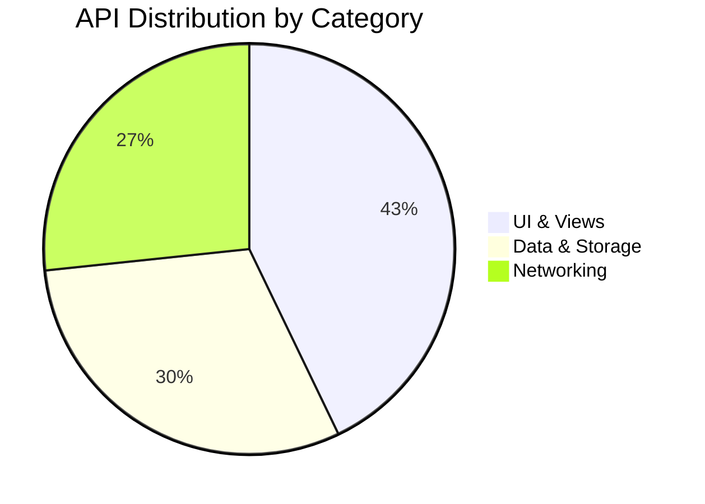
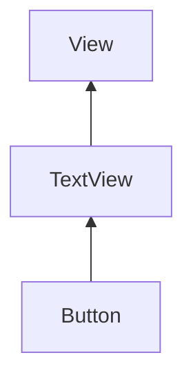

# Android Documentation Crawler System

A comprehensive system for crawling, processing, and organizing Android developer documentation into multiple formats optimized for both human reading and LLM consumption.

## 🎯 Features

### Core Capabilities
- **Web Crawling**: Automatically crawls and extracts Android API documentation from developer.android.com
- **Smart Categorization**: Organizes APIs into 22+ categories (UI Components, Networking, Data Storage, etc.)
- **Content Generation**: Automatically generates explanations, code examples, and best practices
- **Multi-Format Export**: Outputs in human-readable Markdown and LLM-optimized formats
- **Visual Diagrams**: Creates Mermaid diagrams showing API relationships and hierarchies
- **Bilingual Examples**: Generates both Kotlin and Java code examples

### Output Formats

#### 1. Human-Readable Markdown
- **Location**: `./android-docs-output/markdown/`
- **Features**:
  - Organized by category with navigation
  - Mermaid diagrams for visualizing relationships
  - Syntax highlighting for code examples
  - Cross-referenced documentation
  - Statistics and distribution charts

#### 2. LLM-Friendly JSON/JSONL
- **Location**: `./android-docs-output/llm-format/`
- **Formats**:
  - **`android-docs.jsonl`**: One JSON object per line, perfect for streaming into LLMs
  - **`by-category/*.json`**: Categorized JSON files for selective loading
  - **`embeddings-ready.jsonl`**: Pre-chunked text optimized for vector embeddings
  - **`metadata.json`**: Schema and statistics

#### 3. Embeddings-Ready Format
- **Purpose**: Optimized for RAG (Retrieval-Augmented Generation) systems
- **Features**:
  - Multiple chunks per API (overview, Kotlin example, Java example, use cases)
  - Metadata for filtering and retrieval
  - Optimized chunk sizes for embeddings
  - Reference IDs linking chunks to parent documents

## 📋 Categories

The system organizes documentation into these categories:

1. **UI & Views** - Widgets, layouts, and view components
2. **Activities & Fragments** - Screen management and navigation
3. **Lifecycle & Architecture** - Lifecycle-aware components
4. **Navigation** - Navigation component and patterns
5. **Data & Storage** - Databases, Room, SharedPreferences
6. **Networking** - HTTP clients, network operations
7. **Media & Graphics** - Images, video, audio, graphics
8. **Sensors & Location** - GPS, sensors, hardware access
9. **Permissions & Security** - Security and permission APIs
10. **Background Work** - WorkManager, services, jobs
11. **Notifications** - Notification APIs
12. **Material Design** - Material Design components
13. **Jetpack Compose** - Declarative UI framework
14. **Testing** - Testing frameworks and utilities
15. **Dependency Injection** - DI frameworks
16. **Kotlin Coroutines** - Asynchronous programming
17. **ViewModel & LiveData** - State management
18. **RecyclerView** - List and grid components
19. **Intents & Services** - Component communication
20. **Resources & Assets** - Resource management
21. **Utilities & Helpers** - Utility classes
22. **Core Android** - Core framework classes

## 🚀 Quick Start

### Using the REST API

#### 1. Start a Crawl
```bash
curl -X POST http://localhost:8080/api/crawler/start
```

Response:
```json
{
  "status": "started",
  "message": "Crawl has been started. Use /api/crawler/status to check progress.",
  "config": {
    "baseUrl": "https://developer.android.com/reference",
    "outputDirectory": "./android-docs-output",
    "maxDepth": 3
  }
}
```

#### 2. Check Status
```bash
curl http://localhost:8080/api/crawler/status
```

#### 3. View Configuration
```bash
curl http://localhost:8080/api/crawler/config
```

#### 4. Update Configuration
```bash
curl -X PUT http://localhost:8080/api/crawler/config \
  -H "Content-Type: application/json" \
  -d '{
    "maxDepth": 5,
    "requestDelayMs": 2000,
    "outputDirectory": "./my-android-docs"
  }'
```

### Programmatic Usage

```java
@Autowired
private DocumentationCrawlerService crawlerService;

public void crawlDocs() {
    CrawlResult result = crawlerService.executeCrawl();

    if (result.isSuccess()) {
        System.out.println("Crawled " + result.getStats().getTotalElements() + " APIs");
        System.out.println("Output: " + config.getOutputDirectory());
    }
}
```

## ⚙️ Configuration

### Application Properties

```properties
# Base URLs
android.crawler.base-url=https://developer.android.com/reference
android.crawler.kotlin-url=https://developer.android.com/reference/kotlin

# Crawler Behavior
android.crawler.max-depth=3
android.crawler.max-pages-per-category=100
android.crawler.request-delay-ms=1000        # Polite crawling delay
android.crawler.max-retries=3
android.crawler.timeout-seconds=30
android.crawler.use-selenium=false           # Set true for dynamic content

# Output Settings
android.crawler.output-directory=./android-docs-output
android.crawler.generate-markdown=true
android.crawler.generate-json=true
android.crawler.generate-llm-format=true
android.crawler.generate-diagrams=true
android.crawler.generate-examples=true
android.crawler.generate-explanations=true
android.crawler.generate-use-cases=true
```

### Advanced Configuration

For targeting specific packages:
```properties
android.crawler.target-packages=android.widget,androidx.compose
```

For specific categories:
```properties
android.crawler.target-categories=UI_COMPONENTS,JETPACK_COMPOSE
```

## 📂 Output Structure

```
android-docs-output/
├── CRAWL_SUMMARY.md                 # Overview and statistics
├── markdown/                        # Human-readable documentation
│   ├── README.md                   # Index with charts
│   ├── UI_COMPONENTS.md            # Category pages
│   ├── NETWORKING.md
│   └── UI_COMPONENTS/              # Individual API pages
│       ├── TextView.md
│       ├── Button.md
│       └── ...
└── llm-format/                      # LLM-optimized formats
    ├── android-docs.jsonl          # All docs in JSONL format
    ├── embeddings-ready.jsonl      # Chunked for embeddings
    ├── metadata.json               # Schema and stats
    └── by-category/                # Category-separated files
        ├── ui_components.json
        ├── networking.json
        └── ...
```

## 📊 Example Outputs

### Markdown Example

```markdown
# TextView

| Property | Value |
|----------|-------|
| **Type** | Class |
| **Category** | UI & Views |
| **Package** | `android.widget` |

## Summary
A user interface element that displays text to the user.

## Examples

### Kotlin
\```kotlin
val textView = TextView(context)
textView.text = "Hello, Android!"
\```

### Java
\```java
TextView textView = new TextView(context);
textView.setText("Hello, Android!");
\```

## Class Hierarchy
\```mermaid
graph BT
    TextView --> View[View]
\```
```

### JSONL Example

```json
{"id":"android_widget_TextView","name":"TextView","type":"Class","category":"UI & Views","package":"android.widget","content":"A user interface element that displays text...","kotlinExample":"val textView = TextView(context)...","javaExample":"TextView textView = new TextView(context)...","useCases":["Building user interfaces","Creating custom views"],"url":"https://developer.android.com/reference/android/widget/TextView"}
```

### Embeddings Example

```json
{"id":"android_widget_TextView-overview","documentId":"android_widget_TextView","chunkType":"overview","text":"TextView (Class): A user interface element that displays text to the user.","metadata":{"name":"TextView","type":"Class","category":"UI & Views","package":"android.widget"}}
{"id":"android_widget_TextView-kotlin","documentId":"android_widget_TextView","chunkType":"kotlin_example","text":"Kotlin example for TextView:\nval textView = TextView(context)\ntextView.text = \"Hello\"","metadata":{"name":"TextView","type":"Class"}}
```

## 🔧 Using with Local LLMs

### 1. RAG with Vector Database

```python
# Load embeddings-ready format
import json

chunks = []
with open('android-docs-output/llm-format/embeddings-ready.jsonl', 'r') as f:
    for line in f:
        chunks.append(json.loads(line))

# Create embeddings and store in vector DB
from sentence_transformers import SentenceTransformer

model = SentenceTransformer('all-MiniLM-L6-v2')
for chunk in chunks:
    embedding = model.encode(chunk['text'])
    # Store in your vector database (Chroma, Pinecone, etc.)
```

### 2. Fine-tuning Dataset

```python
# Use JSONL for fine-tuning
with open('android-docs-output/llm-format/android-docs.jsonl', 'r') as f:
    training_data = [json.loads(line) for line in f]

# Format for your LLM training framework
```

### 3. Context Injection

```python
# Load specific category
with open('android-docs-output/llm-format/by-category/ui_components.json', 'r') as f:
    ui_docs = json.load(f)

# Use as context for LLM
context = "\n\n".join([doc['content'] for doc in ui_docs])
prompt = f"Context:\n{context}\n\nQuestion: How do I create a button in Android?"
```

## 🎨 Diagram Examples

The system generates Mermaid diagrams automatically:

### Category Distribution


### Class Hierarchy


## 🛡️ Best Practices

1. **Rate Limiting**: Default 1000ms delay between requests - adjust based on your needs
2. **Error Handling**: The crawler automatically retries failed requests up to 3 times
3. **Incremental Crawling**: Start with specific packages to test before full crawl
4. **Output Management**: Clear output directory between crawls or use different directories
5. **Resource Usage**: Monitor memory for large crawls (consider processing in batches)

## 📈 Performance

Typical crawl statistics:
- **Processing Speed**: ~100-200 pages per minute (with 1s delay)
- **Output Size**: ~50-100MB for comprehensive crawl
- **Memory Usage**: ~500MB-1GB during processing
- **Duration**: 30-60 minutes for full documentation

## 🔍 Troubleshooting

### Issue: 403 Forbidden Errors
**Solution**: Increase request delay or enable Selenium for dynamic content
```properties
android.crawler.request-delay-ms=2000
android.crawler.use-selenium=true
```

### Issue: No Documentation Crawled
**Solution**: Check network connectivity and verify URLs are accessible
```bash
curl -I https://developer.android.com/reference
```

### Issue: Memory Issues
**Solution**: Reduce max pages per category
```properties
android.crawler.max-pages-per-category=50
```

## 🤝 Integration Examples

### With LangChain
```python
from langchain.document_loaders import JSONLoader
from langchain.vectorstores import Chroma

loader = JSONLoader('android-docs-output/llm-format/android-docs.jsonl')
documents = loader.load()
vectorstore = Chroma.from_documents(documents)
```

### With LlamaIndex
```python
from llama_index import SimpleDirectoryReader, GPTVectorStoreIndex

documents = SimpleDirectoryReader('android-docs-output/llm-format/by-category').load_data()
index = GPTVectorStoreIndex.from_documents(documents)
```

## 📚 API Reference

### REST Endpoints

| Endpoint | Method | Description |
|----------|--------|-------------|
| `/api/crawler/start` | POST | Start documentation crawl |
| `/api/crawler/status` | GET | Check crawl status |
| `/api/crawler/config` | GET | Get current configuration |
| `/api/crawler/config` | PUT | Update configuration |
| `/api/crawler/stop` | POST | Stop running crawl |

### Java API

**Main Service**: `DocumentationCrawlerService`
- `executeCrawl()`: Execute complete crawl pipeline
- `CrawlResult`: Contains results and statistics

**Crawler**: `AndroidDocCrawler`
- `crawl()`: Crawl documentation
- `getCategorizedDocs()`: Get organized results

**Exporters**:
- `MarkdownExporter.export()`: Generate Markdown
- `LLMExporter.export()`: Generate LLM formats

## 📄 License

This crawler is for educational purposes. Please respect Android documentation terms of service and use responsibly with appropriate rate limiting.

## 🎯 Roadmap

- [ ] Support for versioned documentation
- [ ] Incremental updates (only crawl changes)
- [ ] Support for additional documentation sources
- [ ] Built-in vector embedding generation
- [ ] Interactive documentation browser
- [ ] Automated testing examples extraction

## 💡 Tips

1. **Start Small**: Begin with a few packages to understand the output
2. **Review Generated Content**: The AI-generated examples are templates - verify accuracy
3. **Customize Categories**: Modify `AndroidCategory` enum for your specific needs
4. **Extend Exporters**: Create custom exporters for your specific LLM format
5. **Monitor Progress**: Use the status endpoint to track long-running crawls

## 🙋 Support

For issues or questions:
1. Check the `CRAWL_SUMMARY.md` in output directory
2. Review logs for detailed error information
3. Verify configuration in `application.properties`
4. Check crawler status via REST API

---

**Happy Crawling! 🚀📱**
